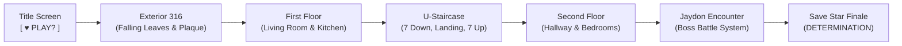

# ♥ Undertale: 4th Anniversary Tribute ♥
### *A playable top-down tribute game celebrating 4 years of Mallika & Jaydon*

---

> [!NOTE]
> **Dedication**: Built as a personalized surprise gift for Mallika & Jaydon's 4th Anniversary. The game faithfully captures the iconic mechanics, dialogue styling, sound design, and emotional warmth of Toby Fox's *Undertale*, while recreating the real-world architecture, memories, inside jokes, and lived-in charm of their townhouse.

---

## 📑 Master Documentation Index

Detailed specifications have been split into modular, focused documents:

1. 🎨 **[Master Scene & Character Redesign Specification (`scene.md`)](scene.md)**
   - *Extensive handoff document for LLM / senior graphic designers.*
   - Contains architectural dimensions, exterior facade rules (Townhouse 316), half-split first-floor layout, U-shaped staircase, narrow second-floor corridor, and character sprite art rules for Mallika & Jaydon.

2. 💬 **[Master Interaction & Dialogue Catalog (`interactions.md`)](interactions.md)**
   - *Complete interaction encyclopedia.*
   - Catalogs every overworld inspectable, choice prompt (`[ YES / NO ]`), C-Menu descriptions, battle actions (Check, Flirt, Smoke, Hug, Items), and the Determination finale.

3. 🧭 **[User Preferences & Design Philosophy (`preferences.md`)](preferences.md)**
   - *Design rules and learned preferences.*
   - Tracks authentic Undertale visual guidelines, spatial proportions, text-wrapping limits, and character design choices accumulated across development.

---

## 🎮 Quick Start & Play Guide

The game requires **zero external build tools, npm packages, or external assets**. It is built completely with vanilla HTML5, Canvas 2D, and the Web Audio API.

### Option 1: Live Web Play (GitHub Pages)
Once enabled on GitHub Pages, the game is playable directly on mobile and desktop at:
👉 **`https://lasts3cond.github.io/4thAnniversary/`**

### Option 2: Local Web Server
If running locally via Python:
```powershell
python -m http.server 8080
```
Then open your browser to: **`http://localhost:8080`**

### Option 3: Direct File Execution
Double-click `index.html` in your file explorer to launch directly in any modern web browser.

---

## 🕹️ Controls Reference

| Key(s) | Function | Context |
|---|---|---|
| **Arrow Keys** or **W, A, S, D** | Move Mallika / Navigate Menus | Overworld / Menus |
| **Z** or **Enter** / **Left Click** | Interact / Confirm / Advance Dialogue | Overworld / Battle |
| **X** or **Shift** | Cancel / Skip / Speed Up Dialogue | Overworld / Battle |
| **C** or **Ctrl** | Open Overworld Menu (`ITEM`, `STAT`, `CELL`) | Overworld |

> [!TIP]
> **Audio Start**: Modern browsers restrict Web Audio autoplay until the user's first gesture. The game features an Undertale **`[ ♥ PLAY? ]`** start screen that seamlessly initializes and starts audio on your first click or keypress.

---

## 🏠 Game Overview & Progression



1. **Title Screen**: Classic Undertale title with pulsing red soul cursor and browser audio unlock.
2. **Exterior (Townhouse 316)**: Fall leaves drifting across an autumn lawn, red brick framing, and the iconic "316" plaque.
3. **First Floor (The Open Loop)**: An authentic half-split townhouse with a living room on the left and kitchen on the right. Includes an L-couch, TV stand, punching bag, puzzle table, and warm oven.
4. **The Staircase**: A compact switchback U-shaped staircase descending to an intermediate landing window before ascending to the top floor.
5. **Second Floor**: A narrow corridor with roommates' doors (Alex, Kevin) leading to Jaydon's bedroom.
6. **Boss Encounter (Jaydon)**: Full Undertale battle engine with Fight meter, rotating Flirt responses, smoke breaks, and a warm hug that unlocks Mercy.
7. **The Finale**: A pulsing golden Save Star, Toby Fox's *Determination* melody, and a heartfelt anniversary message.

---

## 🏗️ Technical Architecture

- **Canvas 2D Rendering**: Native $640 \times 480$ letterboxed CRT viewport with nearest-neighbor scaling (`imageSmoothingEnabled = false`).
- **Web Audio Synthesizer**: Pure Web Audio API synthesizers producing retro square waves, triangle basses, and noise channels for all BGM (*Snowy*, *Home*, *Heartache*, *Determination*) and SFX without external MP3/WAV files.
- **Typewriter Text Engine**: Dynamic word-wrapping with Undertale dialogue box borders and portrait support.
- **Zero Dependencies**: 100% vanilla JavaScript, HTML, and CSS.

---

## 📁 Codebase Manifest

| File | Purpose |
|---|---|
| `index.html` | CRT container, canvas viewport, and script bootstrap. |
| `style.css` | Retro CRT scanlines, CRT screen curvature, and letterboxing styling. |
| `src/game.js` | Main game loop, title screen, input engine, and room transitions. |
| `src/sprites.js` | Procedural pixel art generation for Mallika, Jaydon, portraits, and environment. |
| `src/maps.js` | Room layouts, colliders, inspectable zones, and environment renderers. |
| `src/dialogue.js` | Undertale dialogue boxes, typewriter animations, and `[ YES / NO ]` prompts. |
| `src/battle.js` | Complete battle engine (FIGHT, ACT, ITEM, MERCY, damage capping). |
| `src/finale.js` | Golden Save Star, particle systems, and Determination climax. |
| `src/audio.js` | Web Audio API synthesizer for all 4 music tracks and 10+ sound effects. |
| `scene.md` | Master handoff document for LLM / character and scene redesign. |
| `interactions.md`| Master encyclopedia of all dialogue and overworld/battle interactions. |
| `preferences.md` | Recorded design guidelines and accumulated user preferences. |

---
*Happy 4th Anniversary, Mallika & Jaydon! ♥*