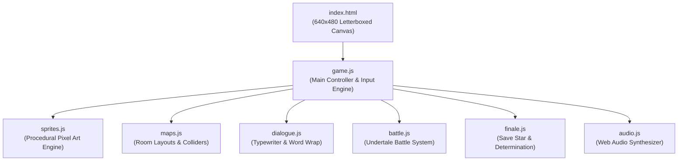
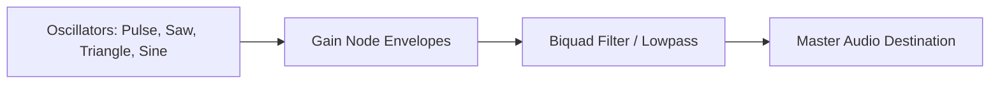

# ♥ Undertale: 4th Anniversary Tribute ♥
### *A playable, top-down tribute game celebrating 4 years of Mallika & Jaydon*

---

> [!NOTE]
> **Dedication**: Built as a surprise gift for Mallika & Jaydon's 4th Anniversary. The game faithfully captures the iconic mechanics, dialogue styling, sound design, and emotional warmth of Toby Fox's *Undertale*, while recreating the real-world architecture, memories, inside jokes, and lived-in charm of their townhouse.

---

## 📑 Table of Contents

1. [Quick Start & Play Guide](#-quick-start--play-guide)
2. [Controls Reference](#-controls-reference)
3. [Architecture & Technical Specifications](#-architecture--technical-specifications)
4. [Master Floor Plans & Room Specifications](#-master-floor-plans--room-specifications)
   - [Room 1: Exterior & Townhouse 316](#1-exterior--townhouse-316)
   - [Room 2: First Floor (The Open Loop)](#2-first-floor-the-open-loop)
   - [Room 3: The Staircase & Landing Transition](#3-the-staircase--landing-transition)
   - [Room 4: Second Floor Hallway](#4-second-floor-hallway)
5. [Character Specifications & Pixel Art Engine](#-character-specifications--pixel-art-engine)
   - [Mallika (Protagonist)](#mallika-protagonist)
   - [Jaydon (Boss Encounter)](#jaydon-boss-encounter)
6. [The Battle System Engine](#-the-battle-system-engine)
   - [FIGHT System](#fight-system)
   - [ACT Submenus](#act-submenus)
   - [ITEM Submenus](#item-submenus)
   - [MERCY System](#mercy-system)
7. [Audio Architecture (Pure Web Audio API)](#-audio-architecture-pure-web-audio-api)
8. [The Finale: Save Star & Determination](#-the-finale-save-star--determination)
9. [File Structure & Codebase Manifest](#-file-structure--codebase-manifest)
10. [GitHub Pages Deployment Guide](#-github-pages-deployment-guide)

---

## 🎮 Quick Start & Play Guide

The game requires **zero external build tools, npm packages, or external assets**. It is built with vanilla HTML5, Canvas 2D, and Web Audio API.

### Option 1: Live Web Play (GitHub Pages)
Once enabled on GitHub Pages, the game is playable directly on mobile and desktop at:
👉 **`https://lasts3cond.github.io/4thAnniversary/`**

### Option 2: Local Web Server
If running locally via Python:
```powershell
python -m http.server 8080
```
Then navigate to: **`http://localhost:8080`**

### Option 3: Direct File Execution
Double-click `index.html` in your file explorer to launch directly in any modern browser (Chrome, Edge, Firefox, Safari).

---

## 🕹️ Controls Reference

| Key(s) | Function | Context |
|---|---|---|
| **Arrow Keys** or **W, A, S, D** | Move Mallika | Overworld |
| **Arrow Keys** or **W, A, S, D** | Move Reticle / Select Option | Battle / Menus |
| **Z** or **Enter** | Interact / Confirm / Advance Text | Overworld / Battle |
| **X** or **Shift** | Cancel / Run (1.5x speed) / Fast-forward Text | Overworld / Battle |
| **C** or **Ctrl** | Open Overworld Menu (`ITEM`, `STAT`, `CELL`) | Overworld |

> [!TIP]
> *Audio Note*: Web browsers require a single user interaction before unmuting Web Audio. Press any key or click the canvas once to start the retro chiptune BGM.

---

## 🏗️ Architecture & Technical Specifications



### Display & Rendering
- **Canvas Resolution**: Native 640 × 480 pixels letterboxed to preserve classic Undertale 4:3 CRT aspect ratio.
- **Pixel Art Engine**: Nearest-neighbor scaling (`ctx.imageSmoothingEnabled = false`) with procedural sprite generation to off-screen canvases on boot.
- **Collision Detection**: Sub-pixel axis-by-axis feet collision box (`x + 8, y + 42, w: 24, h: 16`), allowing smooth wall-sliding around furniture.
- **Transition Protection**: 800ms doorway transition cooldown to prevent accidental entrance bounce-backs.
- **Text Engine**: Dynamic word-wrapping (30 characters per line, 22 characters with portrait) with automatic chunking into max 3-line dialogue pages.

---

## 🏠 Master Floor Plans & Room Specifications

### 1. Exterior & Townhouse 316

```
+-------------------------------------------------------------------+
|  [DARK WINTER SKY: Falling Snowflakes (y: 0 to 60)]               |
|                                                                   |
|  +--------------------+   +-----------------------+               |
|  | BEIGE ROOFLINE     |   | BEIGE ROOFLINE        |               |
|  | SHINGLED AWNING    |   | SHINGLED AWNING       |               |
|  | DARK RED BRICK     |   | PROTRUDING STAIRWELL  | (Photo 3)     |
|  | [316 PLAQUE] [DOOR]|   | BRICK BAY FEATURE     |               |
|  +--------------------+   +-----------------------+               |
|                                                                   |
|  [WHITE SNOW GROUND: Subtle Footprints (y: 220 to 480)]          |
|                 \___ Front Step Walkway ___/                      |
+-------------------------------------------------------------------+
```

- **Visuals & Architectural Features**:
  - Dark winter night sky with falling snowflakes.
  - Solid dark red brick townhouse facade (`#6b2024` with darker mortar lines).
  - Shingled brown awning overhang (`#4a3728`) with beige horizontal siding above (`#d4ccbd`).
  - **Protruding Stairwell Bay Feature**: Extends outward to the right of the front door where the interior stairs ascend.
  - **High-Contrast "316" Plaque**: Mounted on the brick to the left of the recessed doorway. Crisp gold lettering on black enamel with gold border.
  - **Snow Boundaries**: Snowfall is strictly clipped to the sky and ground—no snow falls across the brick townhouse face.
- **Interactables & Flavor Text**:
  - `Door 316` (`x: 290, y: 195, w: 55, h: 30`): *"Townhouse 316. You step inside to get out of the cold."* (Transitions into First Floor at `x: 155, y: 375`).
  - `316 Plaque` (`x: 250, y: 155, w: 45, h: 35`): *"The numbers '316' shine against the dark red brick."*
  - `Stairwell Bay` (`x: 350, y: 170, w: 100, h: 60`): *"The brick stairwell bay extends outward from the townhouse facade."*
  - `Snow Ground` (`x: 100, y: 300, w: 60, h: 60`): *"A clean, quiet blanket of white snow under the dark sky."*
  - `Footprints` (`x: 480, y: 300, w: 60, h: 60`): *"Soft footprints lead up to the front door."*

---

### 2. First Floor (The Open Loop)

The first floor functions as a continuous rectangular loop connecting the Foyer, Hallway, Living Room, and Kitchen around a finished central interior dividing wall.

```
+----------------------------------------------------------------------------------+
| [GREEN CEILING LED STRIP RUNNING ACROSS THE TOP MOULDING]                        |
|                                                                                  |
| [BRICK] [SCREEN DOOR]             [RED L-COUCH]            [VERTICAL     [KITCHEN|
| [WALL]  (Sliding Glass)        (Facing South, Switch)       TABLE &       DOORWAY|
|                                                             BENCH]       OPENING]|
| [PUNCH                          [COFFEE TABLE: Notes,      (Ducklings            |
|  BAG]                            Strewn Papers, Bowl]       Puzzle /             |
| (Freestanding                                               Blue Cups)   [FRIDGE]|
|  Stand & Legs                  [TV STAND & TV SCREEN]                    (Top)   |
|  w/ Sandbags)                   (Facing North, Streamer)                 [CABINET|
|                                                                           COUNTER]
| [BATHROOM BLOCK]        [HALLWAY RUNNER]    [WARM INTERIOR WALL]         [OVEN & |
| (Door: "BATH")                              (Finished drywall, baseboard, MICROWAVE]
| [SHOE RACK: NBs]                             closet door, no void)       (Bottom)|
| (Leaning on Bath Wall)                                                   [CABINET|
| [FOYER COATS]           [CLOSET: "CLOSET"]                               [SINK & |
| [TILE LANDING]          [FRONT DOOR]  [STAIRS▲] [PANTRY] [CABINETS]       BLINDS] |
|                         (Exit Outside) (To 2nd)                          [DISHWSHR
+----------------------------------------------------------------------------------+
```

#### Detailed Room Layout & Item Catalog:

1. **Bottom-Left Corner (Foyer & Landing)**:
   - **Coat Closet** (`x: 40, y: 385, w: 35, h: 55`): Tucked in the far corner. Solid dark wood door with brass knob.
     - *Flavor text*: `* Just some coats hanging.`
   - **White Shoe Rack Leaning Against Bathroom Wall** (`x: 135, y: 330, w: 25, h: 40`): Vertical leaning rack resting against the bathroom wall holding navy, grey, and white New Balance sneakers.
     - *Flavor text*: `* A familiar row of New Balances leaning against the bathroom wall.`
   - **Entry Tile Landing**: Off-white tiled foyer floor (`x: 40, y: 365, w: 100, h: 75`) in front of the shoe rack and coat closet.
   - **Front Door Entryway** (`x: 155, y: 434, w: 45, h: 12`): High-contrast dark casing (`#1c0f0a`) cleanly separated from the wall and baseboards, with brass threshold and textured coir welcome mat (`x: 158, y: 416, w: 42, h: 16`).

2. **North-Bound Hallway Corridor**:
   - Looking straight ahead from the front door enters a carpeted corridor (`x: 138..213, y: 180..420`) leading directly into the living room.
   - **First-Floor Bathroom** (`x: 130, y: 245, w: 15, h: 45`): Door on the left wall with brass knob and "BATH" label.
     - *Flavor text*: `* You don't have to use the bathroom right now.`
   - **Hallway Storage Closet** (`x: 215, y: 245, w: 15, h: 45`): Door on the right wall mounted on the center dividing wall.
     - *Flavor text*: `* A hallway storage closet. It's packed full.`

3. **Center of House (Interior Partition Wall)**:
   - Defined by `{ x: 215, y: 190, w: 240, h: 155 }`.
   - Replaces the former pitch-black void with authentic warm interior drywall (`#eae3d2`), perimeter wood baseboards (`#3d281a`), and a hallway closet door. Washer and dryer removed completely. Solid collider boundary separating hallway and kitchen.

4. **South Kitchen Wall (The Full Wall from Left to Right)**:
   - **Stairs Entrance** (`x: 215, y: 405, w: 50, h: 35`): Carpeted staircase landing immediately right of the front door.
     - *Trigger*: Transitions to the Staircase intermediate landing (`x: 120, y: 380, dir: 'up'`).
     - *Flavor text*: `* You head up the carpeted stairs...`
   - **Pantry** (`x: 270, y: 390, w: 35, h: 50`): Tall dark pantry with brass hardware.
     - *Flavor text*: `* The pantry is closed.`
   - **Dark Wood Cabinets** (`x: 305, y: 395, w: 45, h: 45`): Left of sink.
     - *Flavor text*: `* Dark wood cabinetry filled with plates and mugs.`
   - **Kitchen Sink & Crooked Blinds Window** (`x: 350, y: 385, w: 45, h: 55`): (Photo 2) Dark wood upper cabinet with hanging pink cleaning gloves, stainless steel basin, bottle of blue Dawn dish soap, and a window looking outside where the mini-blinds hang at a steep 45° crooked slant.
     - *Flavor text*:
       ```text
       * There are dirty dishes.
       * (Clean them? -> There are too many.)
       * Above the sink, the blinds hang completely crooked.
       ```
   - **Dishwasher** (`x: 395, y: 395, w: 35, h: 45`): (Photo 2) Black front panel with silver dial knob.
     - *Flavor text*: `* Never figured out how it worked.`
   - **More Cabinets** (`x: 430, y: 395, w: 115, h: 45`): Extending to the corner.
     - *Flavor text*: `* More dark wood cabinets with bowls and spices.`

5. **Kitchen East Wall (Right Wall: Top to Bottom)**:
   - **Refrigerator** (`x: 545, y: 195, w: 55, h: 60`): Light grey two-door fridge with silver handles.
     - *Flavor text*: `* I'm not particularly hungry.`
   - **Cabinet Counter** (`x: 545, y: 255, w: 55, h: 60`): Middle counter surface.
     - *Flavor text*: `* A kitchen counter with spices and cutting boards.`
   - **White Coil Stove & Microwave** (`x: 545, y: 315, w: 55, h: 70`): (Photo 1) Microwave mounted on top with glowing green digital clock; white coil-top stove below with warm red burner glow.
     - *Flavor text*:
       ```text
       * The oven is warm. A rich aroma of brown sugar and dates fills the kitchen.
       * A microwave sits right on top.
       ```

6. **The Living Room (North Area)**:
   - **Green Ceiling LED Perimeter Strip**: (Photo 1) Vibrant emerald LED lights running along the ceiling moulding (`x: 40..600, y: 58`) casting an ambient green glow.
   - **Exposed Brick Accent Wall**: Small line of bricks on the left wall only (`x: 40..60, y: 60..190`); removed from all other walls.
    - **Freestanding Heavy Punching Bag Station** (`x: 50, y: 68, w: 40, h: 60`): Heavy bag hanging from its own steel contraption with tubular upright, arched arm, and support legs weighed down by heavy canvas sandbags to keep it upright.
     - *Interactive Prompt*: `* A heavy punching bag on its own contraption, weighed down with sandbags. Give it a punch? [ YES / NO ]`
     - Selecting **YES**: Plays hit sound, grants `Attack power +1` (`hasPunchedBag = true`), and responds:
       ```text
       * WHAM!
       * You give the punching bag a solid punch!
       * Attack power +1.
       ```
     - Selecting **NO**: `* You leave the punching bag hanging peacefully.`
   - **Sliding Screen Door** (`x: 95, y: 45, w: 55, h: 30`): Looking out into the snowy night.
     - *Flavor text*: `* It's cold outside.`
   - **Big Red L-Couch in Middle (Swapped)** (`x: 180, y: 72, w: 105, h: 58`): (Photo 1 & 3) Deep maroon/red sectional couch in the middle of the room facing south towards the TV, featuring the Nintendo Switch (with red and blue Joy-Cons) resting on the cushion.
     - *Flavor text*: `* The red couch in the center of the room. Perfect for playing Switch (which is sitting right there).`
   - **Coffee Table Inside the L** (`x: 210, y: 105, w: 45, h: 28`): (Photo 1) Walnut coffee table holding a blue spiral notebook with ruled pages, loose papers just strewn about with handwritten notes, a red pen, and a white cereal bowl with spoon.
     - *Flavor text*: `* Papers just strewn about.`
   - **Big TV Stand & TV in Middle (Swapped)** (`x: 175, y: 142, w: 115, h: 36`): (Photo 1) Wooden media stand directly opposite the couch facing north, holding a wide television screen with a festive metallic rainbow foil banner draped along the adjacent wall.
     - *Flavor text*: `* The TV is quiet. A cozy reflection fills the screen.`
   - **Plastic Long Folding Table Rotated 90° & Bench** (`x: 345, y: 65, w: 48, h: 84`): (Photo 1) White table positioned vertically against the east living room wall with matching white folding bench (`x: 380, y: 70, w: 8, h: 74`).
     - **The Puzzle on Half the Table**: The top half of the table is covered by a jigsaw puzzle of yellow baby ducklings, green lily pads, and pink/white flowers.
     - **Clutter & Blue Cups**: The bottom half holds two tall blue plastic cups and pens.
     - *Flavor text*: `* A cute puzzle of ducklings and flowers.`

---

### 3. The Staircase & Landing Transition

Ascending the stairs requires taking 7 steps up, turning 180° at an intermediate landing with a scenic window, and taking 7 steps up into the second-floor hallway.

```
+-------------------------------------------------------------------+
|                  [INTERMEDIATE LANDING WINDOW]                    |
|             (Falling snowflakes outside the night sky)            |
|                                                                   |
|   [FLIGHT 1: 7 STEPS UP]    [WALL DIVIDER]   [FLIGHT 2: 7 STEPS]  |
|   ▲ Bottom Stair Entry      [280..360]       ▲ Exit to 2nd Floor  |
|   (From First Floor)                         (To Upstairs Hall)   |
|   Handrails (#5a3825)                        Handrails (#5a3825)  |
+-------------------------------------------------------------------+
```

- **Colliders & Mechanics**:
  - Flight 1: Ascends from `y: 440` to `y: 190` on the left.
  - Landing: Spacious carpeted walkway (`y: 100..190`) with wooden handrails.
  - Landing Window (`x: 270, y: 50, w: 100, h: 70`):
    - *Flavor text*:
      ```text
      * You pause at the intermediate landing.
      * Outside, snow falls peacefully through the dark winter night.
      ```
  - Flight 2: Ascends from `y: 190` to `y: 70` on the right.
  - Exit Trigger (`x: 460, y: 50, w: 100, h: 40`): Seamlessly transitions into `second_floor` at `x: 480, y: 380, dir: 'up'`.

---

### 4. Second Floor Hallway

A quiet, carpeted residential hallway running front-to-back lined with closed roommate doors.

```
+-------------------------------------------------------------------+
|  [JAYDON'S ROOM: ENCOUNTER TRIGGER]  |                            |
|  (Door with click interaction)       |  SOLID WALL                |
|                                      |                            |
|  [ALEX'S DOOR]                       |                            |
|  (Furious typing & yelling)          |                            |
|                                      |  CARPETED CORRIDOR         |
|  [STORAGE CLOSET]                    |  (Run & walk area)         |
|  (Suitcases stacked)                 |                            |
|                                      |                            |
|  [BATHROOM DOOR]                     |  [KEVIN'S DOOR]            |
|  ("Don't need to use")               |  (Formal interview voice)  |
|                                      |                            |
|  SOLID WALL                          |  [STAIRS DOWN TO LANDING]  |
+-------------------------------------------------------------------+
```

- **Interactables & Roommate Lore**:
  - **Alex's Door** (`x: 200, y: 80, w: 40, h: 50`):
    - *Flavor text*: `* You hear yelling and furious typing. Must be playing a game.`
  - **Storage Closet** (`x: 200, y: 180, w: 40, h: 50`):
    - *Flavor text*: `* There are some suitcases in here.`
  - **Second-Floor Bathroom** (`x: 200, y: 280, w: 40, h: 50`):
    - *Flavor text*: `* You don't have to use the bathroom right now.`
  - **Kevin's Door** (`x: 400, y: 280, w: 40, h: 50`):
    - *Flavor text*: `* You hear him speaking very formally, must be interviewing.`
  - **Jaydon's Bedroom Door (The Climax Trigger)** (`x: 200, y: 20, w: 80, h: 60`):
    - *Prompt*: `* Knock on Jaydon's door? [ YES / NO ]`
    - If **NO**: `* You decide to wait a moment.`
    - If **YES**:
      1. Plays authentic door open latch sound.
      2. Jaydon's overworld sprite steps into the hallway wearing dark glasses, a long-sleeve crewneck, and red plaid pajama pants.
      3. Dialogue plays:
         ```text
         * The door opens with a gentle click.
         * Jaydon steps into the hallway wearing glasses, a long-sleeve shirt, and red plaid pajama pants.
         ```
      4. Screen flashes black and white 3 times with the iconic Undertale encounter SFX burst, launching the battle!

---

## 🎨 Character Specifications & Pixel Art Engine

### Mallika (Protagonist)

- **Art Design & Visual Traits**:
  - Warm South Asian skin tone (`#be825c` / `#a06846`).
  - Dark wavy hair flowing past shoulders (`#15100e` with `#2b1d18` wave highlights).
  - Dark rounded glasses frames (`#161616`) with crisp white reflection glint (`#ffffff`).
  - Coral/rose tube top (`#e85d75` / `#c44258`).
  - Denim blue overalls (`#355c94` / `#223c63`) worn over the tube top with brass buckles (`#f0c23a`).
  - White sneakers with grey soles (`#f2f2f2` / `#999999`).
  - **Centered Walk Animation**: Natural 3-frame forward/backward stepping animation with zero awkward outward leg sprawling.
- **Overworld Menu (`C` Key)**:
  - **ITEM**:
    - `Sticky Toffee Pudding`: Warm & baked with love.
    - `pretty dress`: A lovely dress waiting to be worn on a date!
  - **STAT**:
    ```text
    * MALLIKA   LV 1
    * HP 20 / 20
    * ATK 10 (or ATK 11 with bag bonus)
    * DEF 10
    * WEAPON: Strong core muscles
    * ARMOR: Denim overalls
    * LOVE: lots
    ```
  - **CELL**:
    ```text
    * You dialed Jaydon's cell...
    * (ring... ring...)
    * A muffled ringtone plays from his bedroom upstairs!
    ```

### Jaydon (Boss Encounter)

- **Battle Sprite (120 × 160 pixels)**:
  - Dark curly hair, glasses, friendly warm expression.
  - Charcoal long-sleeve crewneck shirt.
  - **Red Plaid Pajama Pants**: Red fabric patterned with black and white intersecting flannel grid lines.
- **Four Expressive Dialogue Portraits (80 × 80 pixels)**:
  1. `neutral`: Glasses, curly hair, gentle smile.
  2. `blush`: Rose-red blushed cheeks and bashful expression (used for *Flirt* and *dress*).
  3. `laugh`: Crinkled joyful eyes and open smiling mouth (used for *Fight*, *Pudding*, *Spare*, *Date*).
  4. `cough`: Puffed cheeks, closed coughing eyes, with a tiny pixel puff of smoke (used for *Smoke*).

---

## ⚔️ The Battle System Engine

Strictly faithful to Toby Fox's Undertale battle framework.

```
+-------------------------------------------------------------------+
|                          [JAYDON SPRITE]                          |
|                       (Plaid Pajama Pants)                        |
|                                                                   |
|  +-------------------------------------------------------------+  |
|  | DIALOGUE & ACTION DISPLAY BOX                               |  |
|  | Typewriter blips, word wrap, target reticle meter           |  |
|  +-------------------------------------------------------------+  |
|                                                                   |
|  MALLIKA   LV 1    HP [████████████████████] 20 / 20              |
|                                                                   |
|   [ FIGHT ]        [ ACT ]          [ ITEM ]        [ MERCY ]     |
+-------------------------------------------------------------------+
```

### Stats
- **MALLIKA**: HP 20/20 | LV 1 | DEF 10
- **JAYDON**: HP 20/20 | ATK 1 | DEF 999 (drops to 0 on *Flirt*)
- **Subtitle**: `* (Why is he in pajama pants?)`

### FIGHT System
- Selecting **FIGHT** activates an oscillating vertical reticle moving across a retro attack meter (`speed: 350 px/s`).
- Pressing `Z` or `Enter` stops the reticle, triggering a sword slash SFX and impact sound.
- Attack outcome:
  ```text
  * You try to attack, but you can't bring yourself to do it.
  * Jaydon laughs and dramatically pretends to take 1 damage anyway.
  ```
  *(If Mallika punched the punching bag earlier, Jaydon acknowledges her strong core muscles and bag training!)*
- Jaydon's reaction: `"Haha! Ow, ow, critical hit!"`

### ACT Submenus
1. **Check**:
   - Text: `* JAYDON - ATK 1 DEF 999. Currently trying his best to give you the sweetest anniversary possible.`
   - Jaydon reaction: `"I mean, I really am trying my best here!"`
2. **Flirt**:
   - Portrait: `blush`
   - Effect: Jaydon's DEF drops to 0!
   - Text: `* You give Jaydon that familiar look. Jaydon blushes bright red! His defense dropped to 0.`
   - Jaydon reaction: `"Whoa... hey there... is it warm in here, or is it just you?"`
3. **Smoke**:
   - Portrait: `cough`
   - Effect: Both Mallika and Jaydon take 5 damage (dropping to 15/20 HP); Jaydon's DEF drops by 50.
   - Text:
     ```text
     * You both share a joint.
     * *Cough cough*
     * (Deals 5 damage to both of you! Defense lowered!)
     ```
   - Jaydon reaction: `"*cough cough* Totally worth it though."`
4. **Hold Hands**:
   - Portrait: `neutral`
   - Effect: Jaydon becomes eligible for SPARE! Name turns **YELLOW** on the Mercy menu!
   - Text:
     ```text
     * You take Jaydon's hand.
     * It feels warm and steady.
     * Jaydon's name turns YELLOW on the Mercy menu!
     ```
   - Jaydon reaction: `"You have no idea how much I love holding your hand."`

### ITEM Submenus
1. **Sticky Toffee Pudding**:
   - Portrait: `laugh`
   - Effect: Restores HP back to 20/20! Plays Undertale heal chime.
   - Text: `* You shared the freshly baked Sticky Toffee Pudding! It was made with love. Fully restores HP!`
   - Jaydon reaction: `"Mmm, dates and brown sugar... best pudding ever!"`
2. **dress**:
   - Portrait: `blush`
   - Effect: Style increased by 100!
   - Text: `* You inspect the package... It's a new pretty dress! Mallika's style increased by 100!`
   - Jaydon reaction: `"You're going to look absolutely stunning in it."`

### MERCY System
1. **Spare**:
   - Available once *Hold Hands* is selected or any 2 acts are performed (name turns yellow).
   - If not yet eligible: `* Jaydon isn't ready to be spared yet. Try taking his hand or showing some love first!`
   - If eligible:
     ```text
     * You chose to SPARE Jaydon.
     * YOU WON! You earned 0 EXP and lots of LOVE.
     * But you gained something infinitely more precious.
     ```
     Triggers the **Finale Climax**!
2. **Date**:
   - Always available! Instant unconditional victory!
   - Text:
     ```text
     * You chose to DATE Jaydon!
     * An absolute critical hit of pure joy straight to his heart!
     * Jaydon says: 'YES! A thousand times yes!'
     ```
     Triggers the **Finale Climax**!

---

## 🎵 Audio Architecture (Pure Web Audio API)

All audio is synthesized in real time via JavaScript without external MP3 or WAV files:



### Sound Effects (SFX)
- `textBlip`: 180Hz square wave micro-clicks at 25ms intervals.
- `menuMove`: 440Hz short retro menu chirp.
- `menuSelect`: 880Hz confirmation chirp.
- `menuCancel`: 220Hz downward pitch cancel tone.
- `encounter`: 3 staccato low-frequency noise/buzz bursts (iconic Undertale battle starter).
- `slash`: Fast white noise frequency sweep.
- `hit`: Low square punch burst with sudden decay.
- `heal`: Two-tone arpeggiated chime.
- `saveDing`: C6-E6-G6 high sine chime.
- `door`: Gentle low acoustic click.

### Synthesized BGM Tracks
1. **`snowy`** (*Exterior Townhouse*): Quiet, airy triangle-wave lullaby evoking cold winter silence.
2. **`home`** (*First Floor, Staircase, Second Floor*): Warm, cozy acoustic guitar/flute style counterpoint melodies.
3. **`battle`** (*Jaydon Boss Fight*): Driving 8-bit pulse-wave bassline with heroic counter-melodies inspired by Toby Fox's *Heartache*.
4. **`determination`** (*Finale*): Gentle music-box chime arpeggio creating an emotional climax.

---

## 🌟 The Finale: Save Star & Determination

When the battle concludes via **SPARE** or **DATE**:

1. The screen smoothly fades to black as the battle BGM transitions into the synthesized *Determination* music box theme.
2. A pulsing golden **Save Star** materializes in the center of the dark screen, rotating gently and radiating sparkle particle motes.
3. The classic Undertale dialogue box types letter-by-letter:
   ```text
   * (Knowing how much love, laughter, and adventures you share...)
   * (...it fills you with DETERMINATION.)
   * Happy Anniversary, Mallika. I love you.
   ```
4. The scene rests peacefully, glowing with the pulsing star.

---

## 📁 File Structure & Codebase Manifest

```
4thAnniversary/
├── index.html            # Main entry point, 640x480 retro canvas container
├── style.css             # CRT styling, letterboxing, retro font imports
├── README.md             # Complete project specification and design documentation
├── .gitignore            # Clean git exclusion rules
└── src/
    ├── audio.js          # Web Audio API retro chiptune synthesizer & SFX engine
    ├── sprites.js        # Procedural pixel art generator for characters & environment
    ├── dialogue.js       # Typewriter text engine, auto-pagination & word wrap
    ├── maps.js           # Room geometry, coordinate colliders, and interactables
    ├── battle.js         # Full Undertale battle system engine
    ├── finale.js         # Save star animation and anniversary dedication
    └── game.js           # Main loop, input manager, state controller & C-menu
```

---

## 🌐 GitHub Pages Deployment Guide

To make the game accessible to anyone on a phone, tablet, or laptop without needing a local development environment:

1. Visit your repository settings on GitHub:
   👉 **`https://github.com/LastS3cond/4thAnniversary/settings/pages`**
2. Under **Build and deployment**:
   - **Source**: Select `Deploy from a branch`
   - **Branch**: Select `main` and `/ (root)`
   - Click **Save**.
3. In approximately 60 seconds, your game will be live at:
   👉 **`https://lasts3cond.github.io/4thAnniversary/`**

---

<p align="center">
  <b>Happy 4th Anniversary, Mallika! ♥</b><br>
  <i>Made with pure love, determination, and code.</i>
</p>